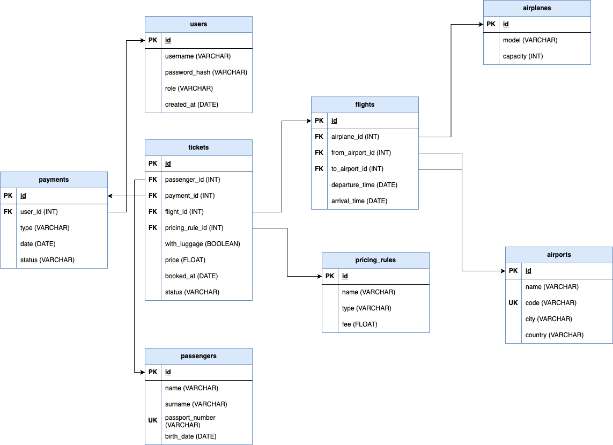
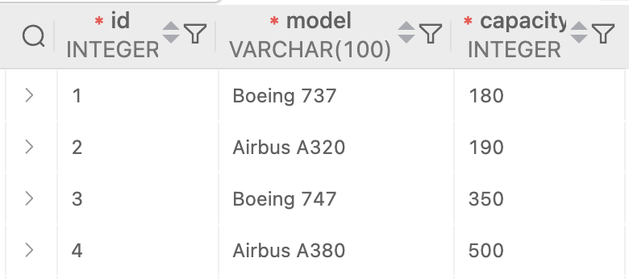
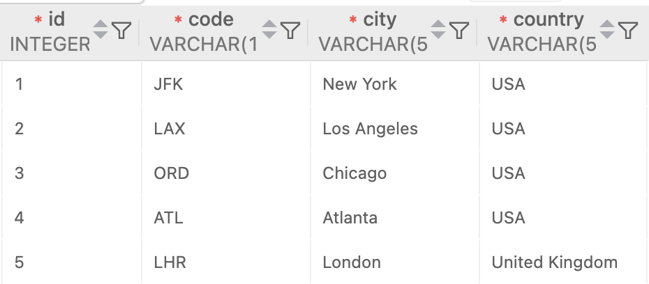
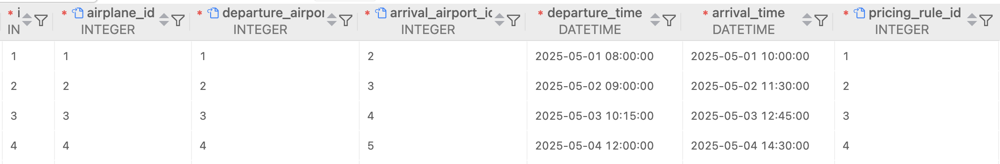
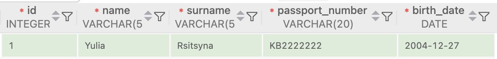
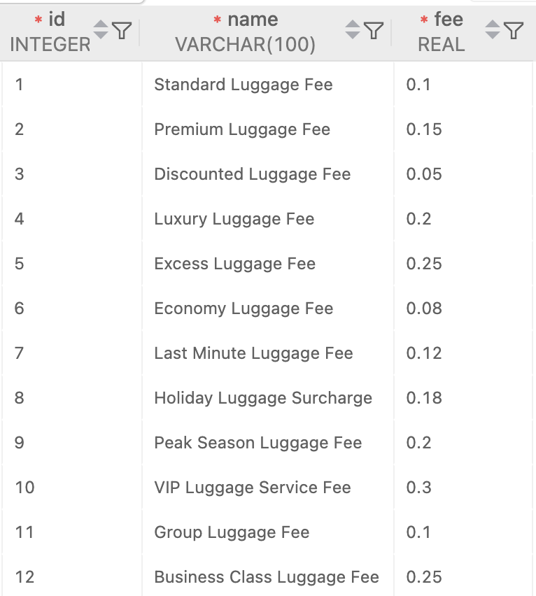
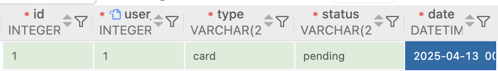

# Database schema

### Entities
- **Airplanes** (model, capacity)
- **Airports** (unique code, name, city and country)
- **Flights** (unites information about departure and arrival places and dates)
- **Users** (authenticated users if the application)
- **Passengers** (owners of tickets bought for certain flights, can be added by authenticated users)
- **Pricing rules** (includes options of class or luggage availability)
- **Payments** (activates the ticket, can be payed by authenticated user)
- **Tickets** (unites information about passenger, flight and payment) 

## Tables

### Airplanes

### Airports

### Flights

### Users

### Passengers

### Pricing rules

### Payments

### Tickets

## Relationships

`Airplanes` -> one to many -> `Flights`

`Airports` -> one to many -> `Flights`

`Flights` -> one to many -> `Tickets`

`Tickets` -> one to many -> `Payments`

`Tickets` -> one to many -> `Passengers`

`Tickets` -> one to many -> `Pricing rules`

`Payments` -> one to many -> `Users`
