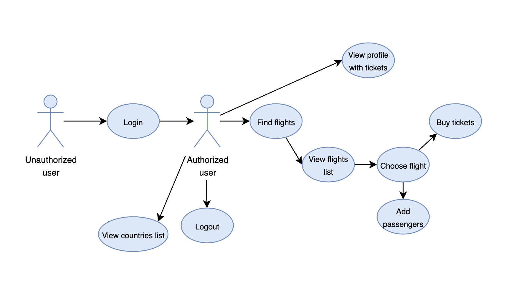

# Requirements

## Functional requirements

| Function                          | Behaviour                                                  |
|-----------------------------------|------------------------------------------------------------|
| View a menu of app functionality  | Users can open an ineractive menu to change the page.      |
| Register or log in                | Users can become clients by registring of loging in. By doing this, they will be able to buy tickets and open private routes.|
| Discover countries                 | Users can open a list of countries and discover information about them to choose the destination.                        |
| Find appropriate and available flights         | Users can find flights by filling in departure and arrival dates and places of departure and arrival.                     |
| View available tickets and their prices with or without luggage     | The system responds with the searched flights by filled params.   |
| Buy several tickets for prefered flight    | Users can enter data of passengers to buy several tickets for one flight. The system must respond with the precounted price that either encludes or excludes the luggage.        |
| View payment page and methods    | Users can choose the prefered method of payment and buy the chosen tickets for one or more passengers.                             |
|View profile page| Users can find out information about themselves and view the list of bought tickets.|

## Non-functional requirements

| Category                          | Description                                                  |
|-----------------------------------|--------------------------------------------------------------|
| Security                          | Ensures a high level of security for personal accounts by protecting users' personal data with hashing their passwords.                                                                      |
| Compatibility                     | Android                                                      |
| Reliability                       | The code of the provided application has full unit and ui testing coverage, so it ensures about the correct execution of the application.|
| Usability                         | The application provides user-friendly and intuitive graphical interface to easily understand the idea and functionality. |
| Performance                       | The provided application is able to handle large amounts of data with the use of database, the appropriate validation methods allow to secure data and proccesses executed.|
| Data integrity                    | Data stored in the system is accurate, consistent, and up-to-date, with appropriate validation mechanisms in place to prevent data corruption.|
| Error handling                    | The application gracefully handles errors and provides error messages to allow user understand what went wrong.|

## Use Case Diagram

## Text Scenarios

### Scenario 1: Registration of unauthorized user

**Actor**: Unauthorized user

**Preconditions**: The user has installed and opened the application or has logged out earlier.

**Main flow**:

1) User opens the app on login page.
2) User enters username and password (and confirm password) and submittes the form.
3) In case of success, user is navigated to main page, visa versa error message appeares.

### Scenario 2: Buying tickets

**Actor**: Authorized user

**Preconditions**: The user has already logged in and knows place of destination.

**Main flow**:

1) User opens the app on main page.
2) User navigates to search form and enters departure and arrival dates and places.
3) The application responds with list of flights available. User can choose any and view information. He can also choose if he wants to include luggage in the form.
4) If there're several passengers, user can enter their name, surname and passport number. After that he sees the price and can choose payment method.
5) After buying the ticket(s), user can go to profile page and see list of his tickets.

### Scenario 3: User wants to choose country to go to

**Actor**: Authorized user

**Preconditions**: The user has already logged in and doesn't know where to go.

**Main flow**:

1) User opens the app on main page.
2) User navigates to countries form.
3) He can search for countries and discover information about them.
4) After discovered countries, user knows the destination and can continue with finding flights.

