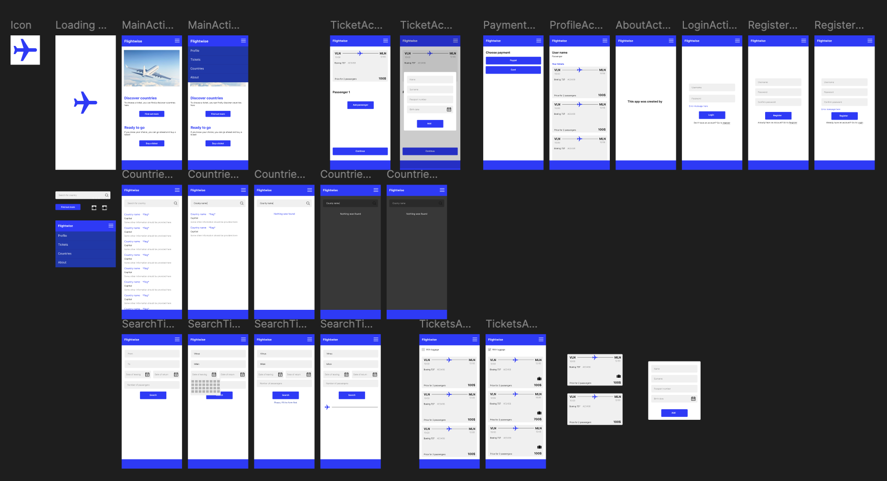
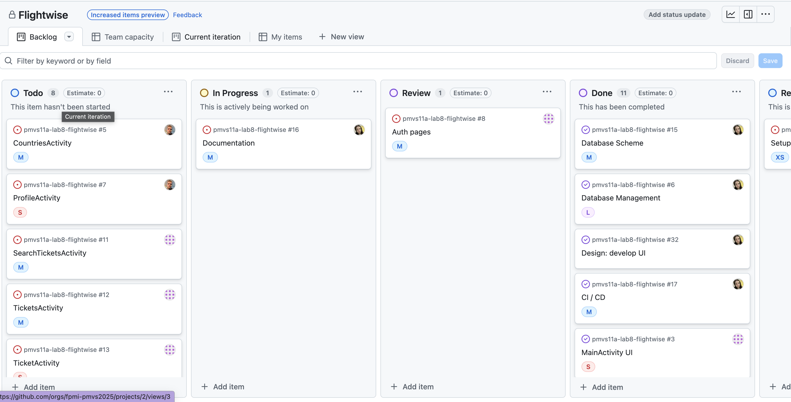

# Assignment

Team laboratory work on chosen subject area. Main aim of the work is to apply skills learned during the course. The objective of the task is to build an application for **Android** on **Java / Kotlin** that will provide next functionality:
1. create mobile application that provides multi-window interface with several activities and fragments
2. envolves database management (**SQLite**)
3. builds UI with **Jetpack Compose**

## Team

<table align="left">
  <tr>
    <td>
      
    </td>
    <td valign="middle">
      <a href="https://github.com/yuliaraitsyna" target="_blank">
        <b>Yuliya Raitsyna</b>
      </a>
    </td>
    <td>
      <li>Team Lead</li>
      <li>Project Manager</li>
      <li>Designer</li>
      <li>Database Manager</li>
    </td>
  </tr>
<tr>
    <td>
      
    </td>
    <td valign="middle">
      <a href="https://github.com/tayadj" target="_blank">
        <b>Cyril Filippov</b>
      </a>
    </td>
    <td>
      <li>Developer</li>
      <li>UI Designer</li>
      <li>Tester</li>
    </td>
  </tr>
<tr>
    <td>
      
    </td>
    <td valign="middle">
      <a href="https://github.com/Stanislau-Senkevich" target="_blank">
        <b>Stanislau Senkevich</b>
      </a>
    </td>
<td>
      <li>Developer</li>
      <li>Tester</li>
    </td>
  </tr>
</table>

## Design
The [design](https://www.figma.com/design/VqNQYq2KZ2AiWljsShsAlO/Untitled?node-id=0-1&t=Ouslw9tbzb4DAVXm-1) was implemented in Figma.

## Project management
